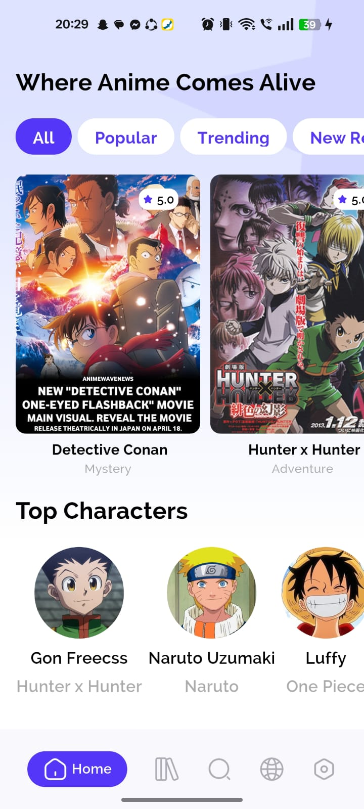
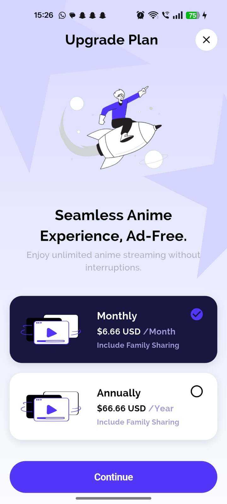

# Week2 - Flutter UI Project

A small Flutter project built with **Clean Architecture** principles.  
This project focuses mainly on UI implementation and code structure best practices.

## 📸 Screenshots

| Home Screen | Details Screen | Upgrade Plan |
|-------------|----------------|--------------|
|  |  |  |

## 🚀 Getting Started

Clone the repository:

```bash
git clone https://github.com/your-username/week2.git
cd week2
